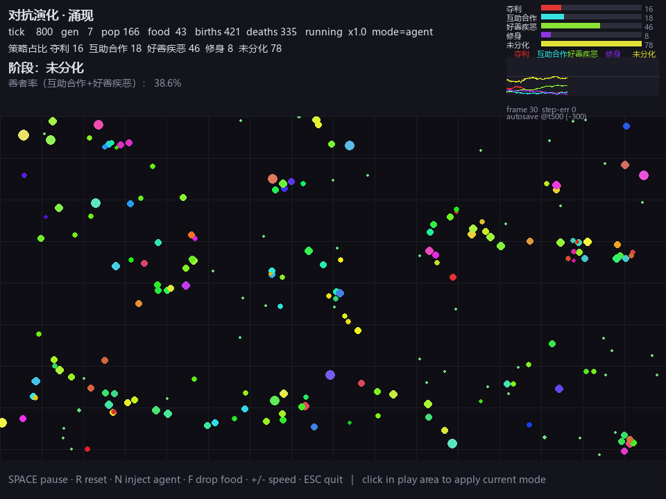

# 对抗演化 · 涌现

> 基于《[对抗演化与合作跃升](https://github.com/Wing-2025/Adversarial-Evolution)》一书做的演化沙盒。
> 8 个性状的 agents 在 toroidal 世界里**自然涌现**夺利 / 互助合作 / 修身 / 好善疾恶 / 未分化 5 种策略。



## 这是什么

一片黑暗中的小圆点。开局 80 个个体，每个有 8 个随机性状（`aggression` / `cooperation` / `metabolism` / `speed` / `sense` / `defense` / `repro_thr` / `mut_rate`），他们吃食物、互相攻击、合作分享、繁殖、死亡。**没有任何预设的策略标签** —— 书上讲的所有演化策略都从性状组合中**自然涌现**。

色相 = 个体在 (攻击性, 合作性) 性状空间的角度，**策略从颜色直接读出**：
- 🔴 **红** 夺利 · 🔵 **青** 互助合作 · 🟢 **黄绿** 好善疾恶 · 🟣 **蓝紫** 修身 · 🟡 **黄** 未分化

按 `R` 换种子，剧本就重写一次。同一份代码，五种截然不同的演化路径：

| seed | 末态 | 剧情 |
|---|---|---|
| 7 | 修身主导 | coop 暴跌到 0.16, 64% 修身 |
| 42 | 未分化 | 朴素合作 ↔ 未分化 反复 |
| 99 | 夺利丛林 | avgAgg 0.50 → 0.84 |
| 13 | 未分化 | 朴素合作/夺利/未分化三方拉锯 |
| 2024 | 好善疾恶主导 | 38% GVBE, 夺利/合作者共存 |

## 快速开始

```bash
# 装依赖
pip install -r requirements.txt

# 玩
python game/adversarial_evolution.py

# 无渲染跑（用于回归/调参）
SDL_VIDEODRIVER=dummy python game/adversarial_evolution.py --ticks 1000 --seed 42

# 看调试遥测
SDL_VIDEODRIVER=dummy DEBUG_TELEMETRY=1 python -u game/adversarial_evolution.py --ticks 1000 --seed 42
```

## 控制

| 按键 | 作用 |
|---|---|
| `SPACE` | 暂停 / 继续 |
| `R` | 用新随机种子重置 |
| `N` | 鼠标点击 = 注入全随机新个体 |
| `F` | 鼠标点击 = 投放一团食物 |
| `+` / `-` | 仿真速度 ±0.5x（范围 0.05x ~ 8x）|
| `ESC` | 退出 + 自动保存本局 JSON |

## HUD 怎么读

- **顶部** 状态行 + 5 类别策略占比 + 当前剧情阶段 + 善者率
- **右上** 5 行策略分布条形图（每行 = 一个策略类别，颜色 = 该策略色相）+ 5 类策略时间序列折线图
- **右下** 帧计数 + autosave 状态（`autosave @tN (-K)` 显示上次自动保存的 tick 和距今多少 tick）

## 自动保存

每 500 tick 自动写一份到 `game/runs/autosave_{run_id}.json`，**同局内自动覆盖**。手动退出（ESC / R / 关窗 / 崩溃）再写一份到 `game/runs/{时间戳}.json` 作为最终快照。

## 可视化报告

```bash
# 整个目录
python game/visualize.py game/runs/ --out game/runs/report.html

# 单局
python game/visualize.py game/runs/2026-07-08_13-26-15.json
```

生成单文件 HTML（含交互图、CDN 引用 plotly.js，可邮件附件）：

| 节 | 内容 |
|---|---|
| §1 时间序列 | 4 子图：avgAgg / avgCoop / good / pop vs tick，多局不同颜色叠加 |
| §2 阶段时间线 | 每局一行的彩色背景块 |
| §3 (agg, coop) 2D 轨迹 | 把每局画在 2D 平面上，看种群在性状空间怎么漂 |
| §4 多局终态总结 | 末态阶段柱状图 + 末态散点 + 关键指标表 |

## 与书的对应

| 书中概念 | 游戏机制 |
|---|---|
| 夺利亏损定律 `1+1<2` | 攻击者固定付 0.06 夺利税 |
| 合作红利定律 `1+1>2` | 同色分享（1:1）+ 聚簇红利（涌现）|
| 短视夺利递进律 | 涌现：seed=99 avgAgg 0.50 → 0.84 |
| 霍布斯丛林 | 末态阶段：夺利 ≥ 60% |
| 跨维度自相似 | 沙盒本身 —— 微观小球群 = 宏观文明演化 |
| 维度跃升 / 维度坍缩 | 阶段分类器自动识别 |
| 逆淘汰 | 善者率折线可看到 |

**未实现**（游戏当前缺的）：善选择 / punish 动作、针锋相对 TFT、群体选择、内共生。详见 `GAME.md`。

## 项目结构

```
Adversarial-Evolution-Sandbox/
├── CLAUDE.md                 # 工程导览（给 AI 看的）
├── GAME.md                   # 游戏说明 + 8 动作精确规则
├── README.md                 # ← 你在这
├── requirements.txt          # pygame + plotly
├── .gitignore                # 排除 repo/ + game/runs/ + .claude/
├── docs/
│   ├── hud.png               # 游戏 HUD 截图
│   └── sample_report.html    # 可视化报告示例
└── game/
    ├── adversarial_evolution.py   # 单文件游戏 (900+ 行)
    └── visualize.py              # 落盘 → plotly HTML
```

## 调试

```bash
# 每 50 tick 打一次种群均值
DEBUG_TELEMETRY=1 python -u game/adversarial_evolution.py --ticks 1500 --seed 42

# 看 stdout:
# t=  50 pop=103 food=141 births=17  deaths=3   avgE=0.53 ...
# t= 100 pop=99  food=132 births=41  deaths=22  ...
# t= 500 pop=133 food=60  births=218 deaths=166 ...
```

## 文档

- **[GAME.md](GAME.md)** — 完整游戏说明 + 8 动作精确规则 + 5 类别分类阈值
- **[CLAUDE.md](CLAUDE.md)** — 工程导览（给未来 AI 看的）

## 致谢

- 书仓：[Wing-2025/Adversarial-Evolution](https://github.com/Wing-2025/Adversarial-Evolution)
- 视觉库：[pygame](https://www.pygame.org/) 2.6
- 报告库：[plotly](https://plotly.com/python/) 5+
